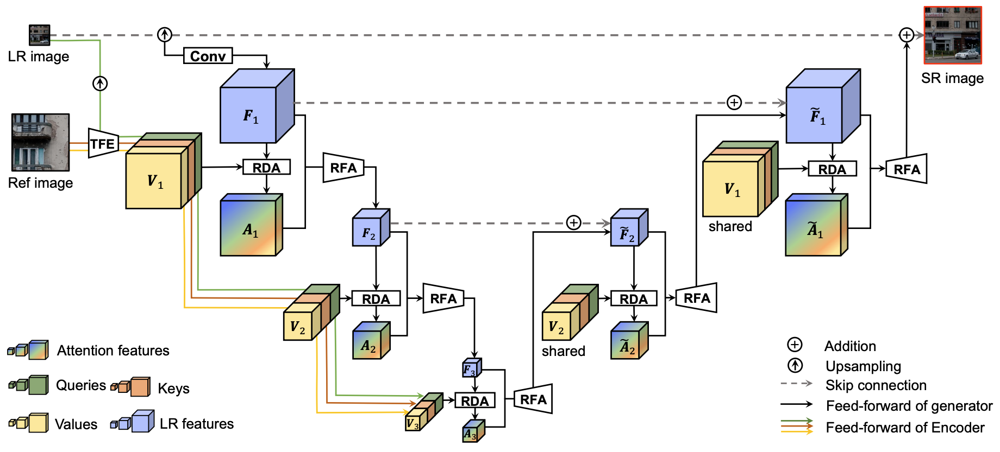
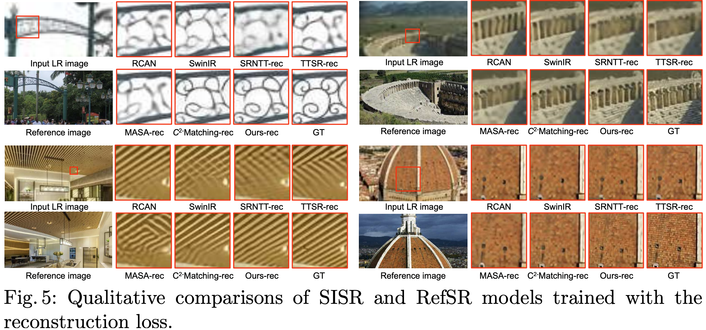
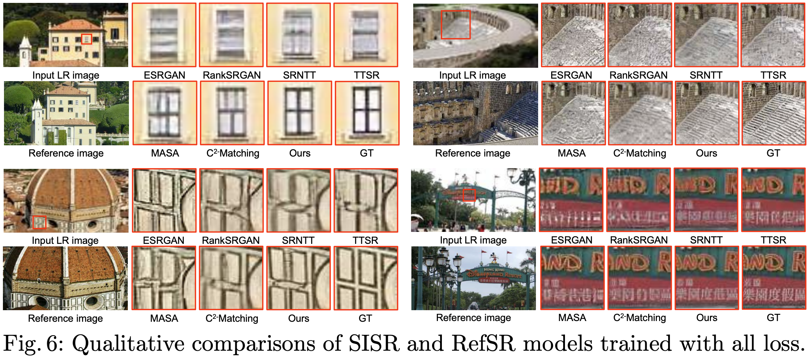

# Reference-based Image Super-Resolution with Deformable Attention Transformer (ECCV 2022)

[Jiezhang Cao](https://www.jiezhangcao.com/), [Jingyun Liang](https://jingyunliang.github.io), [Kai Zhang](https://cszn.github.io/), [Yawei Li](https://ofsoundof.github.io/),  [Yulun Zhang](http://yulunzhang.com/), [Wenguan Wang](https://sites.google.com/view/wenguanwang), [Luc Van Gool](https://scholar.google.com/citations?user=TwMib_QAAAAJ&hl=en)

Computer Vision Lab, ETH Zurich.

---

[arxiv](https://arxiv.org/abs/2207.11938)
**|**
[supplementary](https://github.com/caojiezhang/DATSR/releases)
**|**
[pretrained models](https://github.com/caojiezhang/DATSR/releases)
**|**
[visual results](https://github.com/caojiezhang/DATSR/releases)

[](https://arxiv.org/abs/2207.11938)
[](https://github.com/caojiezhang/DATSR)
[](https://github.com/caojiezhang/DATSR/releases)


This repository is the official PyTorch implementation of "Reference-based Image Super-Resolution with Deformable Attention Transformer"
([arxiv](https://arxiv.org/abs/2207.11938), [supp](https://github.com/caojiezhang/DATSR/releases/download/v0.0/supplementary.pdf), [pretrained models](https://github.com/caojiezhang/DATSR/releases), [visual results](https://github.com/caojiezhang/DATSR/releases)). 

---

Reference-based image super-resolution (RefSR) aims to exploit auxiliary reference (Ref) images to super-resolve low-resolution (LR) images. Recently, RefSR has been attracting great attention as it provides an alternative way to surpass single image SR. However, addressing the RefSR problem has two critical challenges: (i) It is difficult to match the correspondence between LR and Ref images when they are significantly different; (ii) How to transfer the relevant texture from Ref images to compensate the details for LR images is very challenging. To address these issues of RefSR, this paper proposes a deformable attention Transformer, namely DATSR, with multiple scales, each of which consists of a texture feature encoder (TFE) module, a reference-based deformable attention (RDA) module and a residual feature aggregation (RFA) module. Specifically, TFE first extracts image transformation (e.g., brightness) insensitive features for LR and Ref images, RDA then can exploit multiple relevant textures to compensate more information for LR features, and RFA lastly aggregates LR features and relevant textures to get a more visually pleasant result. Extensive experiments demonstrate that our DATSR achieves state-of-the-art performance on benchmark datasets quantitatively and qualitatively.

<p align="center">
  
</p>

#### Contents

1. [Requirements](#Requirements)
1. [Quick Testing](#Quick-Testing)
1. [Training](#Training)
1. [Results](#Results)
1. [Citation](#Citation)
1. [License and Acknowledgement](#License-and-Acknowledgement)


## TODO
- [ ] Add pretrained model
- [ ] Add results of test set


## Requirements
> - Python 3.8, PyTorch >= 1.7.1
> - CUDA 10.0 or CUDA 10.1
> - GCC 5.4.0

## Quick Testing
Following commands will download [pretrained models](https://github.com/caojiezhang/DATSR/releases) and [test datasets](https://github.com/caojiezhang/DATSR/releases). 

1. Clone Repo and Install Dependencies
    ```bash
   git clone https://github.com/caojiezhang/DATSR.git
   cd DATSR
   conda install pytorch=1.7.1 torchvision cudatoolkit=10.1 -c pytorch
   pip install mmcv==0.4.4
   pip install -r requirements.txt
   ```


## Dataset 

- Train Set: [CUFED Dataset](https://drive.google.com/drive/folders/1hGHy36XcmSZ1LtARWmGL5OK1IUdWJi3I)
- Test Set: [WR-SR Dataset](https://drive.google.com/drive/folders/16UKRu-7jgCYcndOlGYBmo5Pp0_Mq71hP?usp=sharing), [CUFED5 Dataset](https://drive.google.com/file/d/1Fa1mopExA9YGG1RxrCZZn7QFTYXLx6ph/view)

Please refer to [Datasets.md](datasets/DATASETS.md) for pre-processing and more details.

## Get Started

### Pretrained Models
Downloading the pretrained models from this [link](https://github.com/caojiezhang/DATSR/releases) and put them under `experiments/pretrained_model folder`.

### Test

We provide quick test code with the pretrained model.

```bash
# Run test code for models trained using only **reconstruction loss**.
PYTHONPATH="./:${PYTHONPATH}" python datsr/test.py -opt "options/test/test_restoration_mse.yml"

# Run test code for models trained using **GAN loss**.
PYTHONPATH="./:${PYTHONPATH}" python datsr/test.py -opt "options/test/test_restoration.yml"
```

## Training

Train restoration network
```bash
# Train the restoration network with only mse loss
PYTHONPATH="./:${PYTHONPATH}" python datsr/train.py -opt "options/train/train_restoration_mse.yml"

# Train the restoration network with all loss
PYTHONPATH="./:${PYTHONPATH}" python datsr/train.py -opt "options/train/train_restoration_gan.yml"
```

## Visual Results

For more results on the benchmarks, you can directly download our DATSR results from [here](https://github.com/caojiezhang/DATSR/releases).





## Citation
  ```
  @inproceedings{cao2022datsr,
    title={Reference-based Image Super-Resolution with Deformable Attention Transformer},
    author={Cao, Jiezhang and Liang, Jingyun and Zhang, Kai and Li, Yawei and Zhang, Yulun and Wang, Wenguan and Van Gool, Luc},
    booktitle={European conference on computer vision},
    year={2022}
  }
  ```

## License and Acknowledgement
This project is released under the CC-BY-NC license. We refer to codes from [C2-Matching](https://github.com/yumingj/C2-Matching) and [BasicSR](https://github.com/xinntao/BasicSR). Thanks for their awesome works. The majority of DATSR is licensed under CC-BY-NC, however portions of the project are available under separate license terms: C2-Matching is licensed under the MIT License, BasicSR are licensed under the Apache 2.0 license.